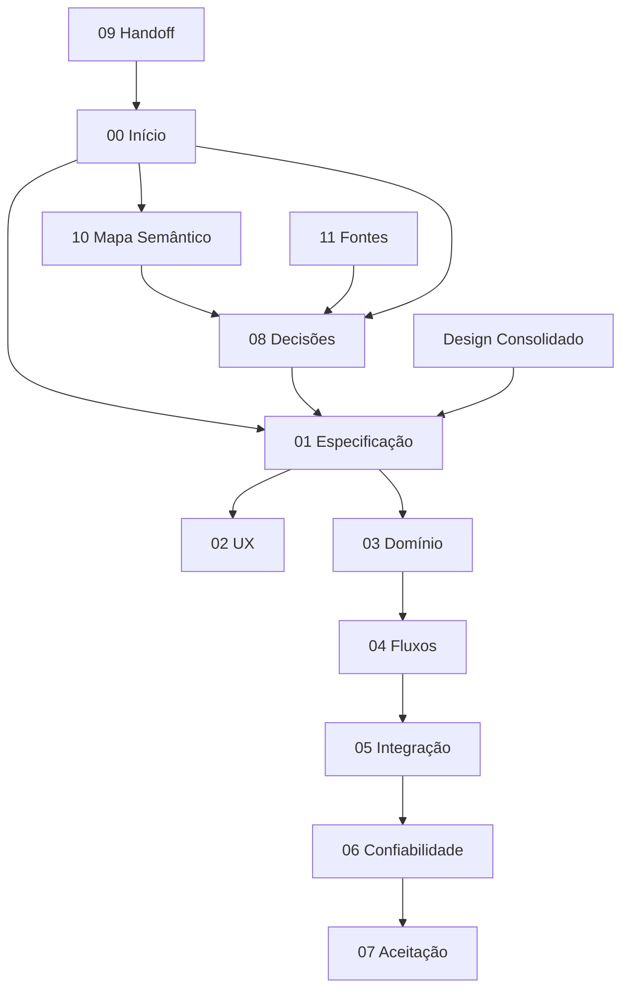

# Produzir Registra — START HERE

> [!abstract] Centro da base de conhecimento
> Este é o ponto de entrada e a fonte de navegação da documentação. Comece pela [[01-MASTER-SPEC|Especificação Mestre]] e use o [[08-DECISION-LOG|Decision Log]] para resolver conflitos de interpretação.
>
> **Percurso recomendado:** [[01-MASTER-SPEC|Especificação]] → [[02-UX-AND-SCREENS|UX]] → [[03-DOMAIN-AND-DATA|Domínio]] → [[04-FLOWS-AND-BUSINESS-RULES|Fluxos]] → [[05-ORIS360-INTEGRATION|Integração]] → [[06-OFFLINE-SECURITY-AUDIT|Confiabilidade]] → [[07-ACCEPTANCE-CRITERIA|Aceitação]]

## 1. O que este projeto realmente é

O **Produzir Registra** é a camada operacional móvel da Produção dentro do ecossistema Óris 360.

Ele não nasce para administrar a fábrica inteira na mão do operador. Nasce para fazer uma coisa muito bem: **transformar o que foi efetivamente produzido em um registro rastreável, simples e confiável**.

A tese operacional é:

> O trabalho físico não deve ser interrompido por burocracia digital.

Na rotina comum, o colaborador olha a realidade da fábrica, produz o que precisa ser produzido e depois registra o resultado. O aplicativo reduz esse registro a poucos passos.

## 2. Problema que o projeto resolve

Existem duas necessidades que parecem conflitantes:

- cada funcionário deve registrar o que produziu, para permitir produtividade individual e rastreabilidade;
- qualquer erro de digitação individual não pode bagunçar o estoque oficial.

A solução aprovada é separar **registro operacional** de **movimento oficial de estoque**.

### Camada 1 — declaração individual

O colaborador registra:
- produto;
- quantidade;
- identidade do usuário;
- data/hora.

O registro nasce como **AGUARDANDO CONFERÊNCIA**.

### Camada 2 — validação física

Um usuário autorizado, com perfil de gestor/conferente:
- vê os registros pendentes;
- pode vê-los consolidados por produto;
- enxerga a composição por colaborador;
- informa/confirma a quantidade física;
- aprova ou registra divergência.

Somente a quantidade conferida gera a movimentação oficial do estoque.

## 3. O que o aplicativo NÃO deve virar

Não transformar o projeto em:
- ERP completo;
- PCP pesado;
- ordem de produção obrigatória;
- checklist de início/fim de turno;
- tela financeira;
- painel gerencial sobrecarregado.

O operador deve sentir que o app é quase um **scanner inteligente de produção**.

## 4. Nome

Nome canônico de trabalho nesta documentação: **Produzir Registra**.

Nome/frase histórica que apareceu em decisões anteriores: **“Produziu, Registra”**.

Para código e pastas, usar `produzir-registra`.

Se a marca final mudar, alterar somente a camada de apresentação; não mudar conceitos de domínio por causa do nome.

## 5. Usuários

### Colaborador de produção

Quer registrar rápido, sem escolher o próprio nome e sem navegar por muitos formulários.

### Gestor/Conferente

Quer validar a verdade física antes que o estoque seja alterado.

### Gestor do Óris 360

Quer rastreabilidade, estoque confiável, histórico, indicadores e capacidade de investigar divergências.

## 6. Navegação funcional

### Colaborador

```
REGISTRAR | PRODUZIDO | NOSSO RESULTADO
```

### Gestor/Conferente

```
REGISTRAR | PRODUZIDO | NOSSO RESULTADO | CONFERIR
```

## 7. Fluxo principal

```
COLABORADOR PRODUZ
        ↓
ABRE/USA O APP
        ↓
ESCANEIA O PRODUTO
        ↓
PRODUTO É IDENTIFICADO
        ↓
INFORMA QUANTIDADE
        ↓
REGISTRA
        ↓
AGUARDANDO CONFERÊNCIA
        ↓
GESTOR CONFERE
        ↓
CONFIRMADO ou DIVERGENTE
        ↓
QUANTIDADE APROVADA MOVIMENTA ESTOQUE
        ↓
HISTÓRICO + INDICADORES + RASTREABILIDADE
```

## 8. Produção livre e necessidades especiais coexistem

A produção normal é livre.

Quando existe uma demanda específica, por exemplo **4.500 unidades de Colorau**, a gestão pode criar uma **Necessidade de Produção**.

Essa necessidade:
- não vira uma ordem que bloqueia outras produções;
- mostra alvo, realizado e saldo;
- pode ser marcada como urgente;
- é abatida automaticamente por registros do mesmo produto quando não há ambiguidade.

## 9. Filosofia motivacional

O usuário é o time da fábrica.

O app deve valorizar quem produz.

Mensagens podem variar por dia da semana e período do dia. Exemplos:
- “Tudo começa nas suas mãos.”
- “Quem faz, faz a diferença.”
- “É daqui que o resultado começa.”
- “Você produz. Você registra. A gente cresce junto.”

A motivação complementa o fluxo; nunca pode atrapalhar a velocidade operacional.

## 10. Filosofia de dados

Preservar sempre três números quando aplicável:

```
DECLARADO PELO COLABORADOR
CONFERIDO PELO RESPONSÁVEL
MOVIMENTADO NO ESTOQUE
```

Nunca reescrever silenciosamente o declarado para fazê-lo “bater”.

## 11. Filosofia de integração

O Produzir Registra não cria estoques paralelos.

Ele conversa com o estoque central do Óris 360.

Historicamente já foi aprovado que:
- não existe “estoque reservado”;
- saldo oficial nunca fica negativo;
- produção física real não deve ser bloqueada por saldo teórico insuficiente;
- quando houver insuficiência de componente, a baixa vai até zero e a exceção precisa permanecer rastreável;
- Produto/Ficha Técnica define a composição padrão;
- Matérias-Primas e Insumos mantêm seus saldos oficiais;
- Indicadores leem e consolidam os eventos.

A decisão atual acrescenta uma camada de segurança: a movimentação oficial decorrente da produção deve acontecer **depois da conferência autorizada**, não no simples registro do colaborador.

## 12. Como uma pessoa ou agente deve ler esta base

A documentação foi separada por responsabilidade para que um agente não precise carregar tudo em um único arquivo.

- visão e regras completas: [[01-MASTER-SPEC|Especificação Mestre]];
- experiência e telas: [[02-UX-AND-SCREENS|UX, Telas e Experiência]];
- entidades e estados: [[03-DOMAIN-AND-DATA|Domínio, Entidades e Dados]];
- fluxos e regras de negócio: [[04-FLOWS-AND-BUSINESS-RULES|Fluxos e Regras de Negócio]];
- integrações: [[05-ORIS360-INTEGRATION|Integração com Óris 360]];
- confiabilidade técnica: [[06-OFFLINE-SECURITY-AUDIT|Offline, Segurança e Auditoria]];
- contrato de testes: [[07-ACCEPTANCE-CRITERIA|Critérios de Aceitação]];
- evolução histórica e precedência: [[08-DECISION-LOG|Decision Log]];
- instrução pronta para agentes: [[09-AI-HANDOFF-PROMPT|Prompt de Handoff]];
- reconstrução semântica da conversa: [[10-CONVERSATION-KNOWLEDGE-MAP|Mapa Semântico]];
- origem das decisões: [[11-SOURCE-TRACEABILITY|Rastreabilidade das Fontes]];
- síntese arquitetural: [[2026-09-22-produzir-registra-design|Design Consolidado]].

### 12.1 Grafo de conhecimento



## 13. Status

Esta documentação representa o entendimento consolidado do projeto em **22/09/2026**.

Ela é uma especificação de produto/domínio. Não afirma que a implementação já exista.
